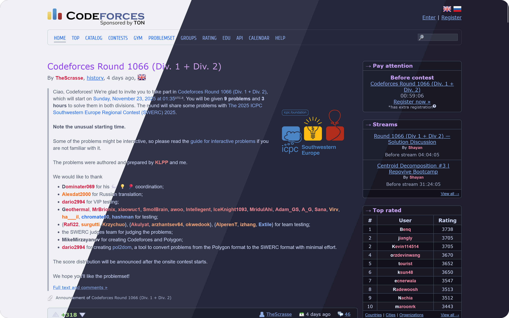
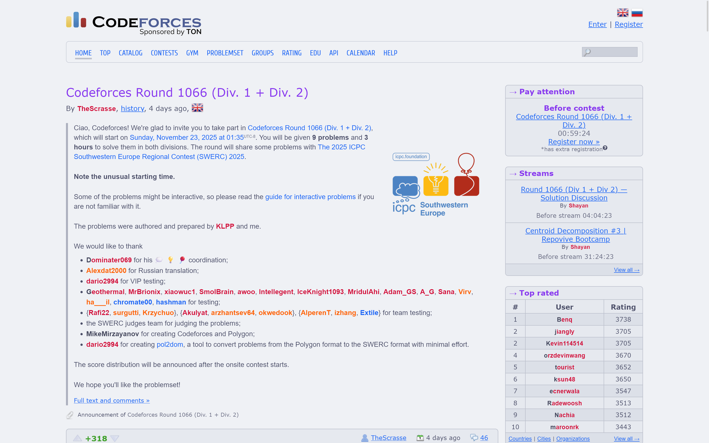
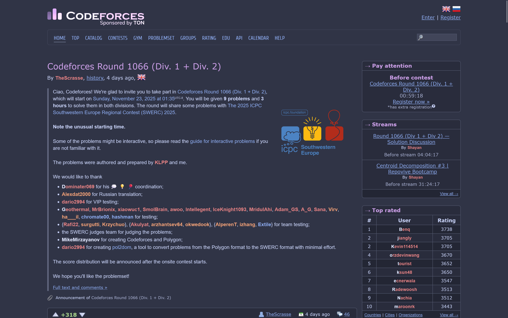
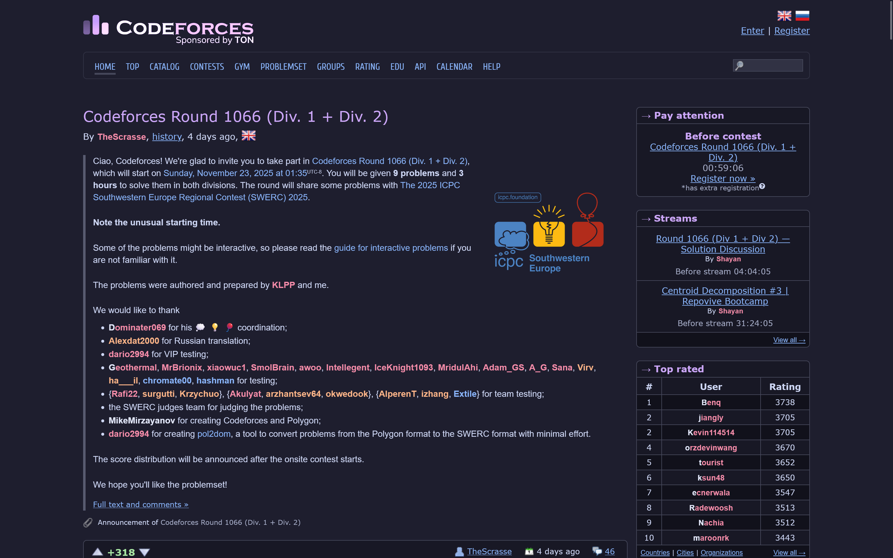

<h3 align="center">
	 
	
  Catppuccin for <a href="https://codeforces.com">Codeforces</a>
	
</h3>

	
	

  

## Previews

🌻 Latte

🪴 Frappé

🌺 Macchiato

🌿 Mocha

## Usage

See [the userstyle usage instructions](https://userstyles.catppuccin.com/getting-started/usage/).

&nbsp;

	

